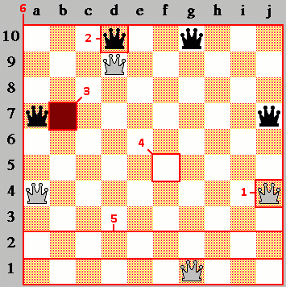
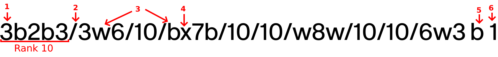

<a id="top"></a>

# Documentation for The Game of the Amazons PureScript Engine


Welcome to **The Game of the Amazons PureScript Engine** (GAPE) documentation!

GAPE is a viewless library to control and validate matches of the wonderful board game of Amazons.

This repository is a **collaborative effort**, so please feel free to make a pull request to add/edit content or create an issue to discuss it. All the necessary guidelines are listed below.

Available languages: [English (en)](.).

## Contents

* [Data Modeling](#data)
* [API Reference](#api)
* [Contributing](#contributing)
  * [Coding](#coding)
  * [Issue Reporting](#issue)
  * [Translating](#translating)

<a id="data"></a>

## Data Modeling

A game of the Amazons is made up of a White and Black player, who are in possession of 4 amazons (chess queens), who move on a 10x10 board and shoot an arrow to make a square unavailable for the rest of the game. These players take turns performing their actions, and lose the game if they are unable to perform any more moves on their turn.

(*Actually the colors of the Amazons were originally Red and Blue, but it has been decided to change them to Black and White by convention. If you want more information about the rules of The Game of the Amazons or learn more about its history, I invite you to visit its [Wikipedia](https://en.wikipedia.org/wiki/Game_of_the_Amazons) page.*).

Thus, the elements of a game are modeled in the following way in GAPE:

<p align="center"></p>

A player is either White or Black:

```haskell
data Team = White | Black
```

A square is either occupied by a White/Black amazon, a fire, or is empty<sup>(1)(2)(3)(4)</sup>:

```haskell
data Square = Empty | Fire | Amazon Team
```

The board is delimited by ranks<sup>(5)</sup> and columns<sup>(6)</sup>:

```haskell
type Rank = Array Square
type Board = Array Rank
```

So in the end, an Amazons match has the next structure:

```haskell
type Amazons = Amazons
    { board :: Board
    , history ::  Array San
    , positions :: Array Fen
    }
```

Some additional aliases have been added to represent format correctness and respect name conventions. These are:

```haskell
type San = String
type Fen = String
```

**San** stands for [Standard Algebraic Notation](https://en.wikipedia.org/wiki/Algebraic_notation_(chess)#Naming_the_squares), a special notation used to represent square coordinates and movements. Its two formats are: `a-j1-10` for coordinates (`d1`, `c4`, ...) and `a-j1-10a-j1-10/a-j1-10` for movements (`d1d9/b3`, `g10d7/f7`, ...). Sample in-progress games can be found [here](/media/samplegames.txt).

**Fen** stands for [Forsyth-Edwards Notation](https://en.wikipedia.org/wiki/Forsyth%E2%80%93Edwards_Notation) a special notation for describing a particular board position of a game. Its format looks like this:

<p align="center"></p>

Each pointed data represents the following: empty subsequent squares in a same rank<sup>(1)</sup>, rank delimitator<sup>(2)</sup>, amazons ((w)hite and (b)lack)<sup>(3)</sup>, fire<sup>(4)</sup>, side to play<sup>(5)</sup> and move number<sup>(6)</sup>. The above FEN will look exactly like the diagram shown in the [start of this section](#data).

<p align="right"><a href="#top">back to top</a></p>

<a id="api"></a>

## API Reference

This section contains the info of all the library functions and its dependencies. A more visual user-friendly model can be found [here](linktothat).

<a id="fen"></a>

### fen :: Amazons -> Fen

Takes a **game** and returns the **FEN** of the current position.

```haskell
fen amazons
-- ↳ "3b2b3/10/10/b8b/10/10/w8w/10/10/3w2w3 w 1"
```

<a id="clear"></a>

### clear :: Amazons

Returns a **game model with an empty board**.

<sub><sup>*See: [load](#load)*</sup></sub>.

```haskell
clear
-- ↳ Amazons { board: [...], history: [...], ... }
```

<a id="ended"></a>

### ended :: Amazons -> Boolean

Takes a **game** and **checks if it's over**.

<sub><sup>*See: [legalMoves](#legalMoves)*</sup></sub>.

```haskell
ended (load "wwwwbbbbx1/xxxxxxxxx1/10/10/10/10/10/10/10/10 w 23")
-- ↳ true
```

<a id="getSqr"></a>

### getSqr :: Amazons -> Int -> Int -> Maybe Square

Takes a **game** a **row index** and a **column index** and **returns the square** if the coordinates are correct.

```haskell
getSqr amazons 0 0
-- ↳ Just Empty
```

<a id="legalMoves"></a>

### legalMoves :: Amazons -> Array San

Takes a **game** and returns the **legal moves** of the current position.

<sub><sup>*See: [movesOfSqr](#movesOfSqr)*</sup></sub>.

```haskell
legalMoves (load "w1x7/2x7/xxx7/10/10/10/10/10/10/10 w 1")
-- ↳ ["a10b10/a10", "a10a9/a10", ...]
```

<a id="remove"></a>

### remove :: Amazons -> String -> Amazons

Takes a **game** and a **coordinate** to remove the piece placed and **returns the new game**. If the coordinate is not valid, the original game is returned instead.

<sub><sup>*See: [put](#put)*</sup></sub>.

```haskell
remove amazons "d10"
-- ↳ Amazons { board: [Empty, Empty, Empty, Empty, ...], history: [...], ... }
```

<a id="amazons"></a>

### amazons :: Amazons

Returns the **initial state** of an Amazons game.

<sub><sup>*See: [load](#load), [initFen](#initFen)*</sup></sub>.

```haskell
amazons
-- ↳ Amazons { board: [...], history: [...], ... }
```

<a id="ascii"></a>

### ascii :: Amazons -> String

Takes a **game** and returns an **ASCII representation** of the current position.

```haskell
ascii amazons
-- All lines are straight
{- ↳
+---------------------+
| . . . b . . b . . . | 10
| . . . . . . . . . . | 9
| . . . . . . . . . . | 8
| b . . . . . . . . b | 7
| . . . . . . . . . . | 6
| . . . . . . . . . . | 5
| w . . . . . . . . w | 4
| . . . . . . . . . . | 3
| . . . . . . . . . . | 2
| . . . w . . w . . . | 1
+---------------------+
  a b c d e f g h i j
-}
```

<a id="moveNumber"></a>

### moveNumber :: Amazons -> Int

Takes a **game** and **returns the move number**.

<sub><sup>*See: [fen](#fen)</sup></sub>.

```haskell
rdIsDig initFen
-- ↳ true
```

<a id="turn"></a>

### turn :: Amazons -> Team

Takes a **game** and returns the **current turn**.

<sub><sup>*See: [fen](#fen)*</sup></sub>.

```haskell
turn amazons
-- ↳ White
```

<a id="get"></a>

### get :: Amazons -> String -> Maybe Square

Takes a **game** and **a coordinate** and **returns the square that occupies it**.

<sub><sup>*See: [getSqr](#getSqr)*</sup></sub>.

```haskell
get amazons "d10"
-- ↳ Just (Amazon Black)

get amazons "a420"
-- ↳ Nothing
```

<a id="load"></a>

### load :: String -> Amazons

Takes a **FEN** and it **converts it** into an `Amazons` model. If the FEN is incorrect, the [initFen](#initFen) is used instead. (*This only loads a static game without movements. If you want to load a match with moves already done see: [loadPgn](#loadPgn).*)

<sub><sup>*See: [parse](#parse)</sup></sub>.

```haskell
load "3b2b3/3w6/10/bx7b/10/xxx7/w8w/xxx2xxx2/10/6w3 w 10"
-- ↳ Amazons { board: [...], history: [...], ... }
```

<a id="loadPgn"></a>

### loadPgn :: String -> Amazons

Takes a **PGN** and returns the **game** with the movements done. If the PGN is incorrect, an starting position game is returned instead. The PGN is automatically trimmed.

<sub><sup>*See: [amazons](#amazons), [move](#move)*</sup></sub>.

```haskell
loadPgn "1. d1d2/c3 d10d9/c10"
-- ↳ Amazons { board: [...], history: ["d1d2/c3", "d10d9/c10"], ... }
```

<a id="parse"></a>

### parse :: String -> Fen

Takes a **string** and checks if it's formatted properly in FEN. Returns **this string** if it's correct, otherwise returns the **initial FEN**.

<sub><sup>*See: [validFen](#validFen), [initFen](#initFen)*</sup></sub>.

```haskell
parse "3b2b3/3w6/10/bx7b/10/xxx7/w8w/xxx2xxx2/10/6w3 w 10"
-- ↳ "3b2b3/3w6/10/bx7b/10/xxx7/w8w/xxx2xxx2/10/6w3 w 10"

parse "3b2b3/3w6/10/b what the hell is this monstrosity 0/xxx7/w8w/xxx2xxx2/10/6w3 w 10"
-- ↳ "3b2b3/10/10/b8b/10/10/w8w/10/10/3w2w3 w 1"
```

<a id="movesOfSqr"></a>

### movesOfSqr :: Amazons -> Int -> Int -> Array San

Takes a **game**, a **row index** and a **column index** and returns the **legal moves** of it.

<sub><sup>*See: [getSqr](#getSqr), [turn](#turn)</sup></sub>.

```haskell
movesOfSqr amazons 9 3
-- ↳ ["d1c2/b3","d1c2/c3","d1c2/c4","d1c2/c5", ...]
```

<a id="pgn"></a>

### pgn :: Amazons -> Pgn

Takes a **game** and **returns its PGN**.

<sub><sup>*See: [moveNumber](#moveNumber)</sup></sub>.

```haskell
pgn (move amazons "d1d2/c3")
-- ↳ "1. d1d2/c3 "
```

<a id="put"></a>

### put :: Amazons -> Square -> String -> Amazons

Takes a **game**, a **square**, and a **coordinate** and **returns the new game**. If the coordinate is not valid, the original game is returned instead.

```haskell
put amazons Fire "a10"
-- ↳ Amazons { board: [Fire, Empty, ...], history: [...], ... }
```

<a id="takeback"></a>

### takeback :: Amazons -> Amazons

Takes a **game** and **undoes its last move**. If no moves were done in the match, it remains the same.

<sub><sup>*See: [fen](#fen)</sup></sub>.

```haskell
gHist (takeback (move amazons "d1d2/c3"))
-- ↳ []
```

<a id="validFen"></a>

### validFen :: String -> Boolean

Takes a **FEN** and **checks if it's valid**.

```haskell
validFen initFen
-- ↳ true

validFen "Otters are cute"
-- ↳ false
```

<a id="move"></a>

### move :: Amazons -> String -> Amazons

Takes a **game** and a **move** in SAN and **returns the new game**. If the move is not valid, the original game is returned instead.

<sub><sup>*See: [moveNumber](#moveNumber), [get](#get), [turn](#turn), [remove](#remove), [put](#put), [movesOfSqr](#movesOfSqr)</sup></sub>.

```haskell
move amazons "d1d2/c3"
-- ↳ Amazons { board: [...], history: ["d1d2/c3"], ... }
```

<p align="right"><a href="#top">back to top</a></p>

<a id="contributing"></a>

## Contributing

Contributions are what make the open source community such an amazing place to learn, inspire, and create. Any contributions you make are **greatly appreciated**.

There are several ways to contribute to GAPE, even if you don't know to program. Below you can find the guidelines for your contribution.

<a id="coding"></a>

### Coding

[Open issues](issues) are a good way to see what to do. Once you've decided  what to work on, please follow the steps below.

> IMPORTANT. If you're planning to add a new feature, please follow the *[Issue Reporting](#issue)* guideline before doing anything.

1. Fork the project
2. Pull the changes from upstream

```git
git pull
```

2. Create a branch

```git
git checkout -b [name_of_your_new_branch]
```

3. Commit your changes

```git
git commit -m 'Your message'
```

4. Push the branch on GitHub

```git
git push origin [name_of_your_new_branch]
```

5. Open a pull request

**Documenting**. Helper functions (the ones with the `'` at the end of its name e.g. `ascii'`) are the only ones that don't need to be documented, although it is necessary to include its dependencies in the main function documentation. E.g. `ascii` doesn't use `sqr2symb`, but `ascii'` does, so it gets included in `ascii`'s dependencies.

**Testing**. Every new feature has to be properly tested. Although [purescript-assert](https://github.com/purescript/purescript-assert) can be used for this, [purescript-quickcheck](https://github.com/purescript/purescript-quickcheck) is the right tool. Although helper functions don't need to be documented, they have to be tested. Coverage should be 100% if possible.

**Style**. Try to follow the [PureScript Style Guide](https://github.com/ianbollinger/purescript-style-guide/blob/master/purescript-style.md). In this project we use *purty* a PureScript formatter. Try to not surpass the 90 column limit.

**Naming conventions**. Use *camelCase*. Functions should have a name that allows us to figure out what they do. Using numbers and acronyms for easier naming is allowed (e.g. `clear`, `loadPgn`).

<p align="right"><a href="#top">back to top</a></p>

<a id="testing"></a>

<a id="issue"></a>

### Issue Reporting

Use *good first issue* tag for issues easy for newcomers.

**Bugs**. Open an issue with the *bug* tag. Ensure to describe what's the bug and try to describe how it happens (platform, version, ...).

**Request new features**. If you have a good idea use the *enhancement* tag. Open this issue before starting any new feature development, so you won't work in vain. Any idea is welcome and greatly appreciated!

**Refactoring**. Codebase can be hard to mantain if it's too complex or unreadable. Use the *refactor* tag to state which part of the code needs a face wash.

**Documentation**. Documentation could be badly translated and unnatural. Open an issue with the *documentation* tag and state where's the issue.

<p align="right"><a href="#top">back to top</a></p>

<a id="translating"></a>

### Translating

Thank you for your precious time! GAPE is for everyone and we really appreciate your help on translating these guidelines. When translating, please follow this rules:

1. Follow the source text ([English (en)](.)) as much as possible. That doesn't mean everything needs to be translated literally. Use the natural expressions of your language instead.
2. Do not translate function/variable/type declaration names.
3. Avoid using over overcomplicated jargon. Simple and concise is usually the best.
4. Don't even think about writing offensive or vulgar language. Discrimination of any kind has no place in GAPE.

We're waiting for your pull requests! 😀

<p align="right"><a href="#top">back to top</a></p>
